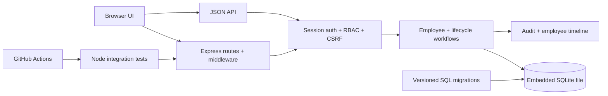

# PeopleOps Console

<!-- repo-intro:start -->
**Project snapshot:** PeopleOps Console is a backend-focused employee operations system demonstrating authentication, RBAC, embedded SQLite, versioned migrations, optimistic concurrency, lifecycle workflows, audit history, OpenAPI documentation, integration tests, and CI.

**What it demonstrates:** Node.js · Express · SQLite · schema migrations · REST APIs · RBAC/security · tests/CI.
<!-- repo-intro:end -->


**PeopleOps Console uses a $0-first architecture.** The complete relational backend runs on Node's embedded SQLite support, so there is no Supabase project, hosted Postgres instance, cloud database account, or paid database service required.

## Engineering highlights

| Area | Implementation |
| --- | --- |
| Runtime | Node.js 24 |
| Web layer | Express 5 + server-rendered EJS + JSON API |
| Persistence | Embedded `node:sqlite`; no external database |
| Schema evolution | Ordered SQL migrations tracked in `schema_migrations` |
| Authentication | Scrypt password hashing + signed HttpOnly session cookies |
| Authorization | Admin / Manager / Viewer RBAC |
| Field security | Compensation visible/editable only to admins |
| Concurrency | Version checks reject stale employee/task updates |
| Lifecycle | Structured onboarding and offboarding workflows |
| History | Employee timeline + operational audit trail |
| Org model | Employee-to-manager relationships + interactive reporting map |
| API | Pagination, filtering, sorting, analytics, OpenAPI 3.1 |
| Security | CSRF, login throttling, CSP, secure headers, request IDs |
| Quality | Integration tests + GitHub Actions CI |

## Architecture



The database defaults to `data/peopleops.sqlite`. It is created automatically and ignored by Git.

## Team structure

The dashboard renders the same manager relationships used by the API as an interactive reporting map. Selecting a person from the reporting tree opens the employee record, lifecycle checklist, and timeline without creating a separate source of truth for organization data.

## Lifecycle workflows

Creating an employee generates an onboarding checklist. Completing onboarding tasks recalculates progress from workflow state rather than trusting a manually entered percentage.

Starting offboarding creates a separate checklist and records lifecycle events. Employee timelines are distinct from the global audit log: the timeline explains what happened to one employee, while the audit trail records operational actions across the application.

## Concurrency safety

Employee and lifecycle-task records use integer versions. Update requests carry the version originally read by the browser. When another update wins first, PeopleOps returns `409 Conflict` instead of silently overwriting newer data.

## Roles

**Admin:** full employee management, compensation, manager assignment, lifecycle workflows, offboarding, and audit history.

**Manager:** operational employee updates, lifecycle workflows, timelines, and audit history, with no compensation access.

**Viewer:** read-only workforce access and employee workflow/timeline visibility, with no compensation or global-audit access.

## Local demo accounts

Fallback credentials exist only in non-production development mode:

```text
admin@peopleops.local   / AdminDemo2026!
manager@peopleops.local / ManagerDemo2026!
viewer@peopleops.local  / ViewerDemo2026!
```

Production mode requires passwords through environment variables and does not render fallback credentials on the login screen.

## Run locally

Requires Node.js 24+.

```bash
npm install
cp .env.example .env
npm start
```

Then open `http://localhost:3000`. No external database setup is required.

## API and migrations

Human-readable API docs are available at `/docs`. The OpenAPI contract lives at `docs/openapi.json` and is also served from `/api/openapi.json`.

Admins can also download a complete sanitized JSON backup from `/api/export` or a spreadsheet-friendly employee CSV from `/api/employees.csv`. Backup user records intentionally exclude password hashes.

Migrations live in `migrations/` and apply in numeric order. Applied versions are recorded inside the local database in `schema_migrations`, so the schema can evolve without replacing the database file.

## Tests

Run the same checks used by CI:

```bash
npm run ci
```

The integration suite covers migrations, authentication, tampered sessions, security headers, RBAC, compensation isolation, pagination, manager relationships, onboarding tasks, task-driven progress, timelines, optimistic-concurrency conflicts, offboarding, CSRF, login throttling, production credential hiding, and OpenAPI delivery.

## Why embedded SQLite?

SQLite still gives this project a real relational database: tables, constraints, foreign keys, indexes, migrations, transactions, and query behavior. The difference is that it is an embedded local file rather than infrastructure we have to buy.

A hosted Postgres/Supabase adapter can be added later if a real deployment needs multi-instance persistence. The portfolio build does not need that expense to prove the backend engineering.

## Project evolution

The original repository was a small Express/MySQL employee-form exercise. PeopleOps Console replaces the old plaintext-password and hard-coded-session patterns with a system centered on authorization, relational modeling, schema evolution, lifecycle workflows, concurrency safety, observability, testing, and documented APIs.
